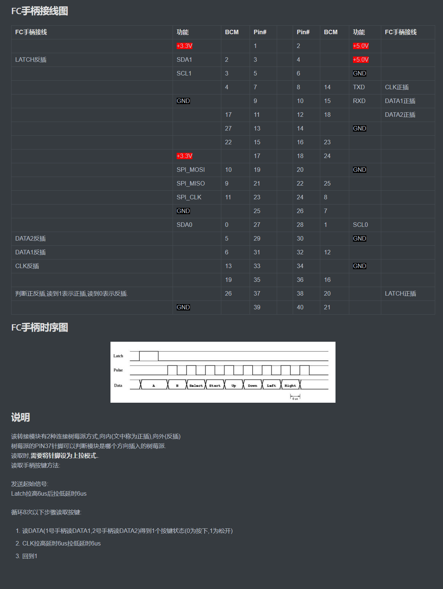

## 树莓派FC手柄控制器Demo

本demo使用 .net core 5 平台开发，适用于树莓派 arm开发板。

使用了linz开发的树莓派 FCController 转接板，支持9孔的nes双手柄。

项目中用到了树莓派的 wiringPi库，已经编译好arm版本在项目目录下 `libwiringPi.so`，当然你也可以自己安装。

visual studio 打开 `Gamepad`项目，编译 发布到指定文件夹或树莓派的ftp中。

可选择打包为一个文件独立运行（不需要安装.net框架）

程序启动后监听8000端口，消息订阅协议使用`websocket`.

websocket 连接地址 ws:/`树莓派IP地址`:8000/gamepad/

访问 http://`树莓派IP地址`:8000 地址会进入到websocket测试页面，连接socket地址后将显示手柄产生的事件

